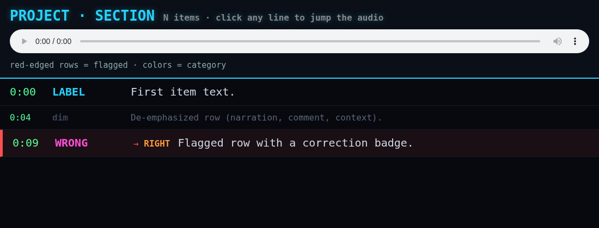

# CYBERDECK

A dark neon terminal theme for single-file HTML reports, dashboards, and
timestamped-media review pages. Big readable monospace, near-black blue
background, cyan neon glow.



## What's in the box

| File | Purpose |
|------|---------|
| `cyberdeck.css` | The theme — all tokens as CSS custom properties |
| `template.html` | Starter page: sticky audio header + clickable timestamped rows |

## Look

- Near-black blue background `#07090f`, monospace (Menlo/Consolas), **20px base font** — built to be read from a distance
- Cyan `#27d4ff` headings with neon glow
- Terminal-green `#55ff99` timestamps / line numbers
- Dimmed 16px `#5a6678` secondary rows for narration, comments, context
- Red `#ff4f4f` left-edge flags for corrections and errors
- 9-color categorical palette (`--cat-*`) for speakers, series, or tags

## Usage

Link it when serving a directory:

```html
<link rel="stylesheet" href="cyberdeck.css">
```

or paste the CSS into a `<style>` block for a fully self-contained page
(the template shows where).

### The signature interaction

The starter template is built for adjudicating timestamped media: a sticky
header embeds an `<audio>` element, and every `.row` carries
`onclick="s(seconds)"` to seek-and-play. Click a line, hear that moment.

```html
<div class="row" onclick="s(42.5)">
  <span class="t">0:42</span>
  <span class="v" style="color:var(--cat-cyan)">LABEL</span>
  <span class="x">Row content.</span>
</div>
```

Row variants:

- `.row.narr` / `.row.dim` — de-emphasized context rows
- `.row.fixed` — red-edged flagged row, with a `.fix` correction badge

Keep media `src` attributes **relative** so pages work both opened from a
folder and served over HTTP.

It works just as well for plain documents — drop the audio element and use
the tokens, header, and row layout as-is.

## Origin

Born on the cue sheets of a Neuromancer audiobook attribution project,
2026. The theme survived; the deck abides.

## License

[MIT](LICENSE)
